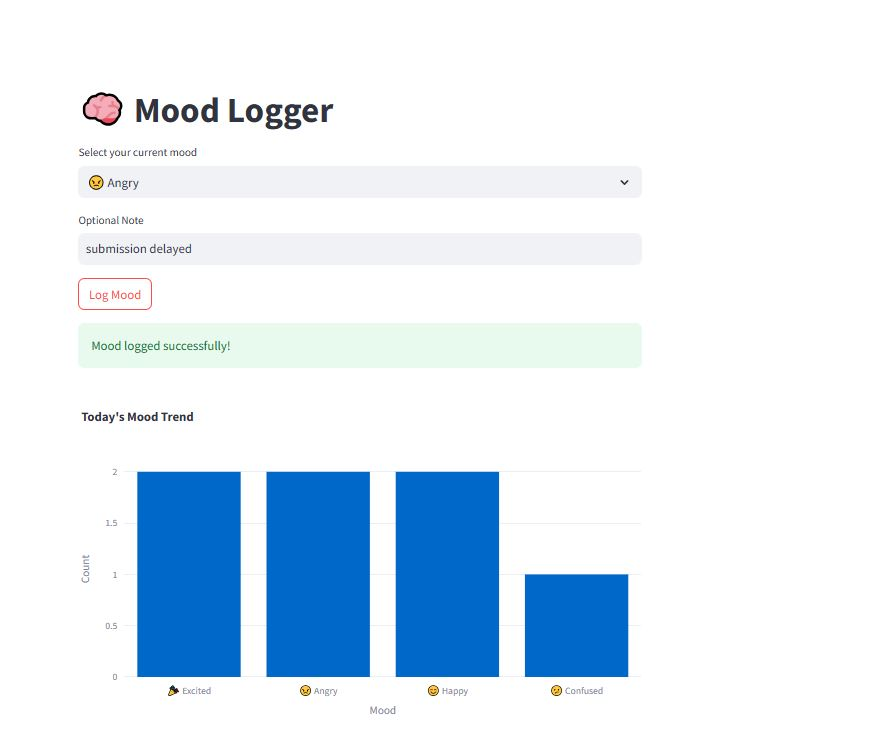

# 🧠 Mood Tracker

A simple internal tool for logging and visualizing emotional trends in a support ticket queue, built with **Streamlit**, **Google Sheets**, and **Plotly**.

---

## ✨ Features

- **Log a Mood**  
  Select a mood and optionally add a short note. The mood entry is timestamped and appended to a Google Sheet.

- **Visualize the Mood**  
  View a bar chart of mood counts for **today**, based on real-time entries.

---

## 🚀 Demo

<p align="center">
  
</p>

---

## 🛠️ Tech Stack

- **Frontend/UI**: Streamlit
- **Storage**: Google Sheets (via Google Sheets API)
- **Data Processing**: Pandas
- **Visualization**: Plotly

---

## 📦 Setup Instructions

### 1. Clone the repository

```bash
git clone https://github.com/your-username/mood-tracker.git
cd mood-tracker

### 2. Install Dependencies

Make sure Python is installed on your machine. Then install the required packages using:
```bash
pip install -r requirements.txt

